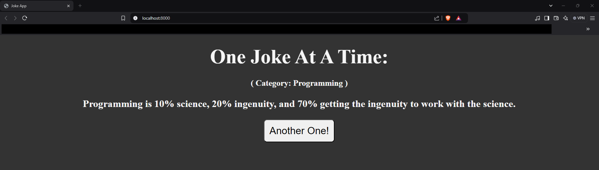

# JokeApp
Flask Web App to retrieve jokes(categorized by type) programmatically and display them.  
  

## Using:
- Web Framework: **Flask**  
- Web Templates: **HTML**  
- Web Styles: **CSS**  
- REST API: **Python Requests module**  
- API Source: [JokeAPI](https://sv443.net/jokeapi/v2/)  
